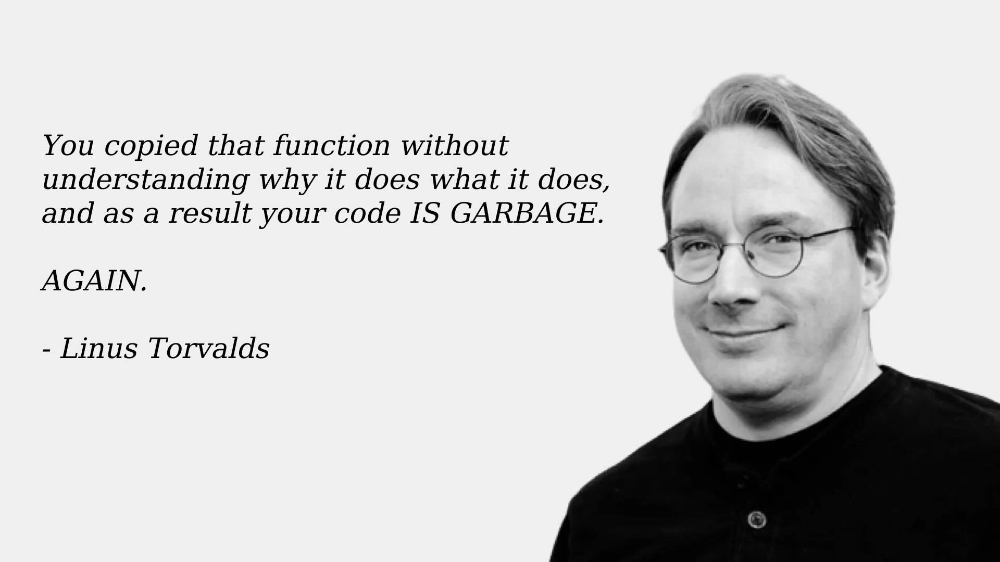

+++

title = "Introduzione e informazioni sul corso"
description = "Laboratorio di Programmazione ad Oggetti"
outputs = ["Reveal"]
aliases = ["/intro/"]

+++

# Introduzione e informazioni sul corso

<!-- write-here "cover.md" -->

<!-- end-write -->

---

## Organizzazione del Laboratorio
* Due turni settimanali
* Il contenuto della lezione e dell'esercitazione settimanale del laboratorio è il medesimo per entrambi i turni
* La gestione della partecipazione ai turni è demandata al prof. Viroli
* Nello stesso giorno avrete sia OOP che OS

### Primo Turno (iniziale cognome nell'intervallo [A-Manp])
* Lunedì, 9:00 - 13:00
* Lab. 2.2, Campus Cesena

### Secondo Turno (iniziale cognome nell'intervallo [Manq-Z])
* Martedì, 13:00 - 17:00
* Lab. 2.2, Campus Cesena

---

## Docente del modulo di laboratorio

### Prof. Danilo Pianini
* mail: `danilo.pianini@unibo.it`
* ricevimento: su appuntamento, da concordare via mail

## 🚧 Assistenti alla didattica 🚧

* ⏳ **Valido fino al _30/09_, sarà poi aggiornato con i nuovi riferimenti**
* 📢 Il laboratorio del 29/30 settembre sarà tenuto da Farabegoli e da uno dei nuovi tutor (non Baiardi)

### Ing. Martina Baiardi
* mail: `m.baiardi@unibo.it`
* ricevimento: su appuntamento, da concordare via mail

### Ing. Nicolas Farabegoli
* mail: `nicolas.farabegoli@unibo.it`
* ricevimento: non disponibile

<!--
### Ing. Angela Cortecchia
* mail: `angela.cortecchia@unibo.it`
* ricevimento: su appuntamento, da concordare via mail
-->

## ‼️ Regole di ingaggio
1. 📝 Si utilizzi il *forum* del corso per qualunque dubbio *tecnico*
2. 📨 Si utilizzi l'*email* solo per discutere argomenti strettamente *personali*
   * ❗ Un esercizio che non riuscite a risolvere **non** è un problema strettamente personale
3. 📌 Se si invia una email, **si mettano in copia _tutti_ i docenti e gli assistenti**

---

## Il Laboratorio

* Consente di mettere in pratica quanto visto nelle lezioni in aula
  * lo studente affronta gli esercizi in prima persona
  * **approccio cooperativo**: lo studente può (ed è invitato a) richiedere il supporto diretto dei pari, dei tutor, e del docente
    * Gli LLM non rientrano fra i pari e non dovrebbero essere consultati
* Integra ed *espande* i contenuti affrontati in aula
  * Introduce *nuovi argomenti* (non affrontati in aula!)
    * Strumenti, metodologie, pratiche, librerie...
  * Fondamentale per arrivare preparati all'esame, e soprattutto per riuscire a fare un buon **progetto**

## Organizzazione di ciascun turno di laboratorio
1. Lezione Frontale (40-80 min)
    * Introduce *nuovi concetti* non visti in aula
2. Esercitazione
    * Un set di esercizi da svolgere in autonomia
    * Evocando il docente in caso di difficoltà
    * Chiedendo **sempre** ai docenti una **correzione finale**

## Pause

Da che termina la parte iniziale, siamo in modalità "*pausa dinamica*": potete entrare e uscire dall'aula a piacimento
* **Una sola regola**: se **siete in lab**, allora **state lavorando**
    * Se avete fame, sete, necessità fisiologiche, voglia di una pausa,
    voglia di andare su TikTok, bisogno di fare una partita a Fortnite...
     *no problem:  uscite e rientrate*
    * Motivo: distrae moltissimo avere persone intorno che fanno cose decisamente più divertenti che scervellarsi su un esercizio

---

## Svolgimento di ciascun esercizio
1. Lettura attenta della consegna
    * Contattare un docente in caso di dubbi
2. Svolgimento dell'esercizio
    * Attraverso esecuzione precisa dei passi riportati nella consegna
    * Contattare un docente in caso di difficoltà
2. **Segnalazione al docente/tutor del avvenuto completamento**
    * *La correzione è fondamentale!*
      * Nella correzione, progressivamente, vi verranno dati suggerimenti per passare da "qualcosa che funziona"
      a qualcosa di ben fatto!
      * Ricordate che in OOP *"funziona" non è una metrica di qualità sufficiente*

---

## Chiarimenti e spiegazioni dopo il laboratorio

Per chiarimenti, ulteriori delucidazioni e spiegazioni _fuori dall'orario di laboratorio_
si incoraggia l'uso del **Forum del Corso**
* link accessibile dal sito del corso su Virtuale
* da preferire all'email inviata direttamente al/ai docente/i

### Riguardo il forum
* Il dubbio di uno studente, probabilmente, è anche il dubbio di qualcun altro (**condivisione**)
* Gli studenti possono aiutarsi (**discussione**)
* Aiutare i colleghi sul forum è **valutato positivamente**

### Riguardo l'email

* L'email resta il canale da utilizzare per comunicazioni **confidenziali**
  * con l'accortezza di mettere sempre in copia _tutti_ i docenti del corso

---

## LLM e strumenti di AI

Esistono strumenti di intelligenza artificiale (tipicamente Large Language Models, LLM)
che possono essere utilizzati per **generare codice**.

* Allenati a partire da grandi quantità di codice sorgente *preesistente*
    * Soggetti al problema "garbage in, garbage out"
    * Risolvono molto bene problemi semplici
    * Spesso commettono errori in problemi complessi
* Fruibili via web o integrati dentro l'ambiente di sviluppo
* Usati sempre di più, anche in contesti professionali
    * Con risultati variabili

### In questo corso: **vietati**

* Non sono consentiti in lab
* Non sono consentiti a casa
* Non saranno disponibili per l'esame
    * E sono abbastanza riconoscibili usando la similarità fra progetti, per la quale abbiamo strumenti che già usiamo

### Motivazione

Sono strumenti *potentissimi*, ma è necessario saperli usare **criticamente**, altrimenti:
* Possono ostacolare e rallentare l'apprendimento
* Possono generare codice di bassa qualità (con bug, inefficienze, o problemi di stile che non riconoscete)
    * Stanno nascendo aziende e professionisti di "AI code cleanup" 
    * Pare che possano accelerare lo sviluppo in piccoli progetti per sviluppatori inesperti,
    ma [studi su progetti complessi con sviluppatori esperti rilevano un rallentamento dello sviluppo del 19%](https://metr.org/blog/2025-07-10-early-2025-ai-experienced-os-dev-study/)
* Possono usare parti del linguaggio che ancora non potete conoscere
    * Ergo, generare codice non ancora comprensibile

---

Linus Torvalds, creatore di Linux, commentando un contributo contenente codice generato da un LLM

---

### Contenuti
* Java toolchain (`java`, `javac`, `jar`, etc.)
* VSCode IDE, strumenti di debug
* Rudimenti di build automation con Gradle
* Controllo di versione
* Documentazione (Javadoc)
* Testing (JUnit)
* Controllo di qualità del codice
* Programmazione multipiattaforma
* Profiling
* Sviluppo di GUI con JavaFX

---

### Obiettivi e struttura del percorso
Acquisire le competenze necessarie per diventare:
* _ottimi_ **programmatori**
* _discreti_ **progettisti**

#### Il percorso
Il corso di laboratorio ha *difficoltà crescente* (superlinearmente, ossia diventa sempre più impegnativo sempre più velocemente)
* Le consegne e il codice passeranno in inglese
* Richiederemo capacità di analisi di trade-off di soluzioni alternative
* Richiederemo sempre maggior qualità
* Useremo strumenti via via più avanzati

#### Fondamentale: **impegno** e **mettersi in gioco**

È un corso molto impegnativo -- lo sappiamo dalle valutazioni degli anni passati, e pensiamo sia giusto che lo sia...
* Richiede attenzione in aula, impegno in laboratorio, e pratica *anche a casa*
  * Purtroppo è difficile recuperare se si resta indietro, la disciplina aiuta!
* Non fermatevi quando "funziona", ma solo quando avete capito *perché* funziona
* Dai docenti avrete il massimo supporto ✊, ma il risultato dipende da voi!

#### Consiglio per chi conosce già Java o altri linguaggi OO/OB (come C#, Javascript, Python, Ruby...)

Impegnarsi fin dall'inizio, anche se nelle prime lezioni sembra facile, e restare sul pezzo!
* Assumere di conoscere già OOP rischia di essere *molto* controproducente
  * Specialmente se si conosce un solo linguaggio OO!

---

# Introduzione e informazioni sul corso

<!-- write-here "cover.md" -->

<!-- end-write -->
