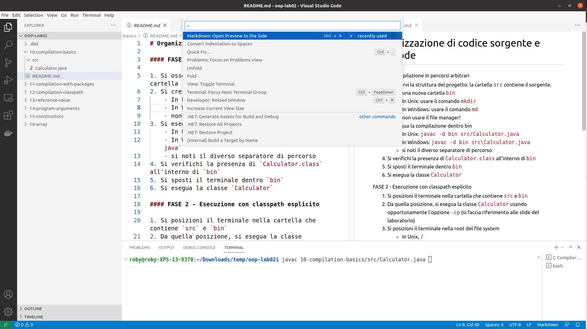
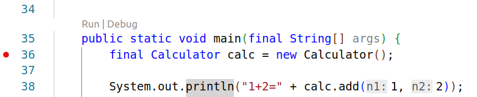
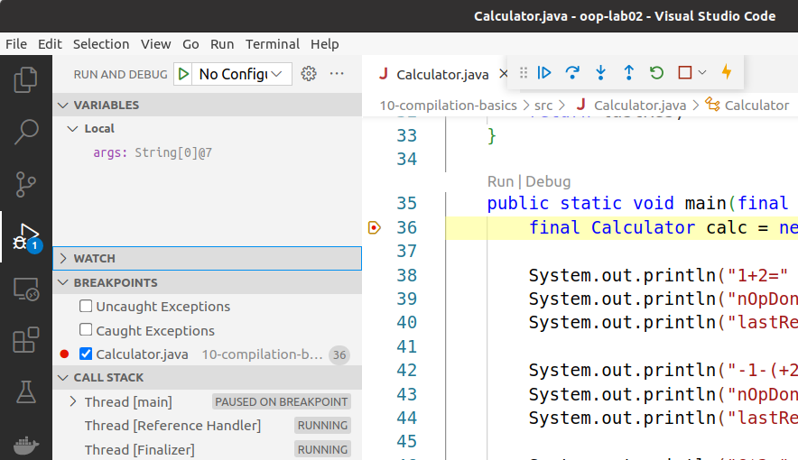

+++

title = "Introduzione a Visual Studio Code e Debugging"
description = "Laboratorio di Programmazione ad Oggetti"
outputs = ["Reveal"]
aliases = ["/vscode/"]

+++

# Introduzione a Visual Studio Code (VSCode) e Debugging

<!-- write-here "cover.md" -->

<!-- end-write -->

---

## Visual Studio Code (VSCode)
* **Visual Studio Code (VSCode)** è un editor di codice sorgente leggero, versatile, e multipiattaforma
* Estendibile attraverso un ecosistema di **estensioni** per vari linguaggi di programmazione e strumenti

---

## VSCode: il concetto di **workspace**

* Il **workspace** è
  * una collezione di *una o più **cartelle*** aperte in una finestra (istanza di VSCode)
  * Tali cartelle sono visualizzate nella vista **Explorer** sulla sinistra
  * più un insieme di **preferenze**, **configurazioni**, **stato**, ed **estensioni** attive memorizzate in una cartella **.vscode/**
* Creazione di un workspace
  * *File $\to$ Open Folder*
* Aggiunta di cartella top-level a un workspace
  *  *File $\to$ Add Folder to Workspace..*
* Salvataggio ed apertura di un workspace
  * *Save $\to$ Workspace as... $\to$* *name*.**code-workspace**
  * *File $\to$ Open Workspace from File*

---

## Utilizzo di VSCode: alcune note

  *  Varie scorciatoie da tastiera
  * <kbd>CTRL</kbd> + <kbd>SHIFT</kbd> + <kbd>P</kbd>: **command palette** (a.k.a. "l'unico shortcut che veramente vi serve ricordare")
  * <kbd>CTRL</kbd> + <kbd>SPACE</kbd>: intellisense (autocompletamento)
  * <kbd>CTRL</kbd> + <kbd>S</kbd>: salvataggio file corrente
  * <kbd>CTRL</kbd> + <kbd>PAGE <i class="fa-solid fa-caret-up"></i></kbd> / <kbd>CTRL</kbd> + <kbd>PAGE <i class="fa-solid fa-caret-down"></i></kbd>: tab sorgente precedente/successivo
  * <kbd>CTRL</kbd> + <kbd>W</kbd>: chiusura della tab corrente
  * <kbd>CTRL</kbd> + <kbd>F</kbd>: cerca nel file corrente
  * <kbd>CTRL</kbd> + <kbd>H</kbd>: sostituisci nel file corrente
  * <kbd>CTRL</kbd> + <kbd>SHIFT</kbd> + <kbd>F</kbd>: cerca in tutti i file del workspace
  * <kbd>CTRL</kbd> + <kbd>SHIFT</kbd> + <kbd>H</kbd>: sostituisci in tutti i file del workspace
*  **Apertura di un terminale:** *Terminal $\to$ New Terminal*
  *  Sarà MOLTO UTILE
*  **Visualizzare/installare estensioni:** *File $\to$ Preferences $\to$ Extensions* oppure <kbd>CTRL</kbd> + <kbd>SHIFT</kbd> + <kbd>X</kbd>

---

## Importanza del debugging

Dato un software che non funziona correttamente, come intercettare l'errore?
* Per semplici esempi, finora, avete *stampato a video* il valore di variabili di interesse
  * E se ve ne fosse sfuggita una, l'avreste aggiunta, ricompilato, rilanciato

Su software complessi **non scala**!
* servono centinaia di stampe
* il flusso di controllo è *troppo complesso* per essere ricostruito tramite stampe
* alcuni valori possono comunque sfuggire
* è comodo **fermare** il software ad un certo punto e **ispezionare** il suo stato
  * nonché, eventualmente, **modificarlo** per testare al volo un comportamento alternativo

Esistono strumenti appositi che consentono di farlo, detti **debugger**!

---

## Debugging in generale

## Linguaggi compilati

I compilatori per programmi che vengono compilati nativamente (come C),
tipicamente,
possono *emettere codice in una speciale modalità debug*
(nel caso di `gcc`, l'opzione `-g` o `-ggdb`).

Questo codice contiene informazioni aggiuntive che consentono di:
* mappare le istruzioni del programma compilato con le righe di codice sorgente corrispondenti
* memorizzare informazioni aggiuntive sulle variabili e sullo stato del programma
* sospendere l'esecuzione del programma in punti specifici

(il tutto, ovviamente, a prezzo di prestazioni inferiori e di un file eseguibile più grande)

I tool di debugging (come `gdb`) possono lanciare l'eseguibile così prodotto e sfruttare le informazioni.

## Linguaggi interpretati

Nel caso degli interpreti (come Python, Ruby, Javascript, ecc.),
il codice sorgente viene eseguito direttamente,
dunque può essere l'interprete stesso a poter fornire informazioni di debugging,
se eseguito con le opzioni opportune.

## Linguaggi compilati in linguaggi intermedi e poi interpretati

Nei linguaggi che vengono compilati in un linguaggio intermedio (come Java o C#),
entrambe le strategie precedenti sono possibili.

Si tende però a usarne una ibrida:
* Si codice in linguaggio intermedio che include informazioni sfruttabili per debug
  * Non serve ricompilare per debuggare
* L'interprete può utilizzarle se in modalità debug, oppure scartarle ottimizzando "al volo"

---

## Debugging: meccanismi

### 1. Controllo di flusso

I debugger consentono di sospendere l'esecuzione del programma in punti specifici detti **breakpoint**.

I breakpoint possono essere **condizionali** (sospendono l'esecuzione solo se una certa condizione è vera).
* Fondamentale per programmi complessi!

Una volta raggiunto un breakpoint, è possibile:
* Continuare l'*esecuzione passo-passo*
  * Opzionalmente "entrando" nelle chiamate di metodo
* Continuare *ritornando al chiamante*
* Continuare fino al *prossimo breakpoint*

### 2. Ispezione

Una volta sospeso il flusso di controllo, il debugger consente di osservare:
1. La *stacktrace* (il "percorso" di chiamate di funzioni che ha portato all'istante corrente)
    * Tipicamente dando la possibilità di navigarla, cambiando lo *scope*
2. Il valore di tutte le *variabili* in scope (inclusi i campi)
3. Calcolare il valore di *espressioni* arbitrarie

### 3. Modifica

A flusso di esecuzione sospeso è anche possibile:
* *modificare* il valore di variabili e campi
* *buttare via* interi stackframe, in modo da ripartire con l'esecuzione di una funzione
  * In questo caso, attenzione a possibili side-effects, che non vengono cancellati...

---

## Debugging in Java tramite VSCode

Nota: richiede l'estensione **Debugger for Java**

* Creazione di **breakpoint** (punti di rottura del flusso di controllo)
  * Click a sinistra del numero di linea di una riga di codice di interesse

---

## Debugging in Java tramite VSCode

* Esecuzione di un'applicazione Java in **"modalità debug"**
  * Click destro su file java $\to$ *Debug Java*
  * Non è magico, aggancia un "agente" a Java, in modo da poter parlare direttamente con la JVM
    * e.g, eseguendo java con: `-agentlib:jdwp=transport=dt_socket,server=y,suspend=n,address=1044`
    si ottiene un interprete che risponderà ai comandi del debugger sulla porta 1044

---

## Debugging in Java tramite VSCode

* Controllo di flusso:
  * <kbd>F10</kbd> **Step Over** o *Run $\to$ Step Over*
  * <kbd>F11</kbd> **Step Into**
  * <kbd>SHIFT</kbd> + <kbd>F11</kbd> **Step Out**
  * <kbd>F5</kbd> **Continue**

* Ispezione del comportamento runtime

	*  *Variables*: vista che mostra le variabili in scope e il loro valore
	*  *Watch*: permette di valutare espressioni rispetto al contesto d'esecuzione corrente

---

# Esercizi di oggi

---

## Preparazione ambiente di lavoro

*  Accedere al PC di laboratorio con le proprie credenziali istituzionali
  *  Accedere al sito del corso
  *  Scaricare il materiale dell'esercitazione odierna
  *  Spostare il file scaricato sul Desktop
  *  Decomprimere il file e aprire con Visual Studio Code la directory ottenuta (File $\to$ Open Folder...)
  *  Puntare il terminale alla directory con i sorgenti dell'esercitazione odierna

---

# Appendice: richiami utili per gli esercizi del lab

## A1 -- Varianza

### Formula per il calcolo della varianza

Sia $n$ il numero di elementi dell'array ed $x_i$ l'elemento all'indice $i$ dell'array, e $\mu$ la media dei valori del suddetto array. La varianza $\sigma^2$ può essere calcolata come:

$\sigma^2 = \frac{\displaystyle\sum_{i=0}^{n-1}(x_i - \mu)^2} {n}$

---

# Introduzione a Visual Studio Code (VSCode) e Debugging

<!-- write-here "cover.md" -->

<!-- end-write -->
