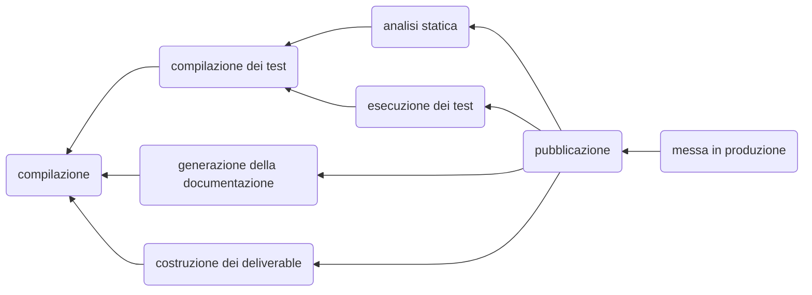
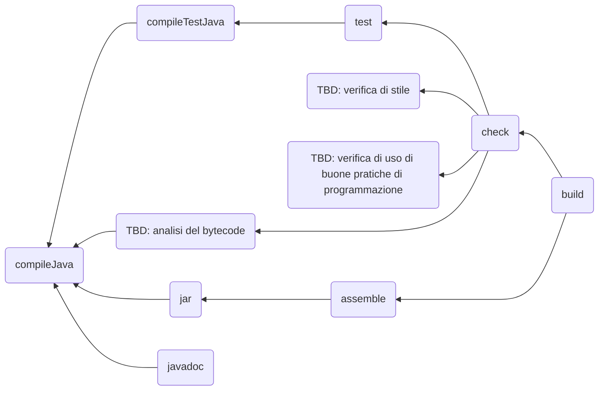

 
+++

title = "Laboratorio di Programmazione ad Oggetti"
description = "Laboratorio di Programmazione ad Oggetti, Ingegneria e Scienze Informatiche"
outputs = ["Reveal"]
aliases = ["/junit-jar-javadoc/"]

+++

# Documentazione del codice e costruzione degli artefatti

{}

---

# Operazioni di verifica usando il build system

---

## Test e build lifecycle

L'esecuzione dei test *è parte integrante* del processo di costruzione del software:

* *compilazione* $\Leftarrow$ la conosciamo
* *compilazione dei test* $\Leftarrow$ non diversa da quello che già sappiamo
* *verifica statica della qualità dei sorgenti* $\Leftarrow$ prossimi lab
* *esecuzione dei test* $\Leftarrow$ **oggi**
* *generazione della documentazione* $\Leftarrow$ **oggi**
* *costruzione degli artefatti "deliverable"* $\Leftarrow$ **oggi**
* *pubblicazione* $\Leftarrow$ magistrale :)
* *messa in produzione* $\Leftarrow$ magistrale :)



---

## Build lifecycle in Gradle

Gradle *mappa* con i task il processo di costruzione del software



L'esecuzione di un task implica l'esecuzione di tutti i precedenti!

* `test` (implica `compileTestJava` che implica `compileJava`): esegue tutti i test
* `check` (implica `test`): esegue i test ed eventuali controlli aggiuntivi che vedremo in futuro
* `assemble` (implica `jar` che impica `compileJava`): costruisce gli artefatti "deliverable"
* `build`: esegue sia `check` che `assemble`

Un buon modo per eseguire l'intero ciclo di vita è `./gradlew build javadoc`!

---

## Separazione fra sorgenti principali e di test

Gradle separa i sorgenti di test da quelli principali del programma in modo netto:
* Sorgenti del software: `src/main`
* Sorgenti di test: `src/test`

Questa è un'ottima pratica: quando andiamo a costruire il nostro "deliverable",
non vogliamo portarci dietro tutti i test compilati,
né tantomeno le librerie che usiamo solo per i test!

D'altra parte, vogliamo che i sorgenti di test siano in effetti parte del progetto.

---

## Configurazione di JUnit 5 in Gradle

Il plugin `java`, di per sé, non configura nessuna suite di test specifica:
va aggiunta al build file la configurazione di JUnit,
seguendo questi passi:

1. Va specificato *dove* JUnit va cercato e (se trovato) scaricato
2. Va specificato quali moduli di JUnit sono da utilizzare, e a che *versione*
    * Sono molti, e noi ne usiamo solo alcuni
3. Va detto a Gradle che vogliamo usare JUnit Platform (è il metodo di avvio dei test in JUnit 5)
    * Si veda https://junit.org/junit5/docs/current/user-guide/#overview-what-is-junit-5
4. Opzionalmente, possiamo chiedere a Gradle di mostrare più output di quanto normalmente farebbe
    * Ad esempio, mostrando quando comincia e quando termina un test, con che risultato, e mostrando il suo output su terminale
    * Diversamente, Gradle si limita a fallire se un qualche test fallisce

---

## Configurazione di JUnit 5 in Gradle

### Dove prendere le librerie

Esistono diversi *repository* con librerie, quello di riferimento per Java è **Maven Central**
* Vedremo poi in dettaglio in futuro

```kotlin
repositories {
    mavenCentral()
}
```

### Scegliere moduli e versioni

Dobbiamo specificare che sono *dipendenze*,
che ci servono *solo per i test*,
che il motore di esecuzione serve *solo a runtime*,
e che *vogliamo una specifica versione*

```kotlin
dependencies {
    val junitVersion = "5.9.1"
    testImplementation("org.junit.jupiter:junit-jupiter-api:$junitVersion")
    testImplementation("org.junit.jupiter:junit-jupiter-params:$junitVersion")
    testRuntimeOnly("org.junit.jupiter:junit-jupiter-engine:$junitVersion")
}
```

---

## Configurazione di JUnit 5 in Gradle

### Usare JUnit Platform

Il task `test` generato dal plugin `java` ha un comodo metodo che pre-configura JUnit 5.

```kotlin
tasks.test {
    useJUnitPlatform()
}
```

### Avere più informazioni in esecuzione

* Stampare ogni evento che succede mentre eseguono i test
* Mostrare l'output dei test, se ce n'è

```kotlin
tasks.test {
    testLogging { events(TestLogEvent.values()) }
    testLogging.showStandardStreams = true
}
```

---

## Build file di esempio

```kotlin
plugins {
    java
}

repositories {
    mavenCentral()
}

dependencies {
    val junitVersion = "5.9.1"
    testImplementation("org.junit.jupiter:junit-jupiter-api:$junitVersion")
    testImplementation("org.junit.jupiter:junit-jupiter-params:$junitVersion")
    testRuntimeOnly("org.junit.jupiter:junit-jupiter-engine:$junitVersion")
}

tasks.test {
    useJUnitPlatform()
    testLogging { events(TestLogEvent.values()) }
    testLogging.showStandardStreams = true
}
```

Da adesso Gradle può lanciare i test JUnit 5 tramite il task `test`!

---

# Assemblamento di applicazioni Java

---

## Packaging di applicazioni Java

* Finora, abbiamo visto che un’applicazione Java è composta di un
insieme di classi: noi vorremmo distribuirla come singolo file!

* Normalmente, le applicazioni Java vengono confezionate in file JAR
(Java ARchive)

### File JAR

* Un JAR è un archivio ZIP che contiene le classi, le risorse (e.g. icone)
e un file descrittivo detto *Manifest*.

* Il Manifest viene creato sempre in `META-INF/MANIFEST.MF`, e
contiene informazioni sull’applicazione, ad esempio su quale classe
contenga il main del programma.

* È possibile associare (a livello di sistema operativo) l’esecuzione del
JAR file al comando Java, in modo che l’applicazione si avvii
automaticamente “col doppio click” (avviando automaticamente la
classe scritta nel Manifest)

* È possibile utilizzare i file JAR come componenti di altre applicazioni (librerie)

---

## Il comando `jar`

Per creare un file JAR, si può utilizzare direttamente il comando `jar`
* Normalmente, tuttavia, ci si avvale del supporto di strumenti di build automation (Gradle, Maven...)

### Opzioni importanti del comando jar
* `c` — Specifica l’intenzione di creare un JAR file
* `f` — Specifica un file di output (se non presente, l’output è rediretto su
standard output)
* `m` — Specifica l’intenzione di allegare un manifest file personalizzato (se non
presente, ne viene creato uno di default, che non specifica alcuna classe da
eseguire)

### Esempi

* `jar cf jar-file.jar file1 file2 directory1`
    * Crea un nuovo JAR file di nome `jar-file.jar` contenente `file1`,
    `file2`, e `directory1`. Include un Manifest di default.
* `jar cf jar-file.jar *`
    * Crea un nuovo JAR file di nome `jar-file.jar` contenente tutti i file
    e le directory nel path corrente. Include un Manifest di default.
* `jar cfm jar-file.jar MYMANIFEST it/unibo/*`
    * Crea un nuovo JAR file, di nome `jar-file.jar`, contenente tutti i
    file e le directory nel path `it/unibo`, con manifest dato dal file
    `MYMANIFEST` nella cartella corrente.

---

## Esecuzione di JAR file tramite command line

`java` ha un'opzione che consente l’esecuzione di file jar: `-jar`

Quando si lancia `java -jar nomefile.jar`,
la Java Virtual Machine automaticamente legge il file *Manifest*,
cerca una descrizione della *Main Class* da eseguire e *tenta di eseguirla*.

---

## Costruzione di file Jar in Gradle

Il plugin `java` include un task chiamato `jar` che si occupa di creare un jar dell'applicazione corrente
* **Non è eseguibile!**
* Il task è pensato per chi costruisce *librerie*
    * Include tutti i compilati (`*.class`) e le risorse del source set `main`
        * Ossia, il risultato della costruzione di tutto quello che si trova in `src/main`
        * Non include i test! (giustamente...)
* Genera un jar che **non** include le *dipendenze*
    * Ossia le librerie che il nostro software usa
* Non specifica alcuna *main class* nel *Manifest*!

---

## (fat/uber/shadow)-jars

Perché un Jar sia eseguibile, deve includere:
1. Una main class nel Manifest
2. Tutti i compilati e le risorse dell'applicazione
    * Tutto quello che deriva da `src/main`
3. Tutte le **librerie** che servono al software
    * Altrimenti, avremo dei `NoClassDefFoundError` o delle `ClassNotFoundException` (in reflection)

Un Jar file con queste caratteristiche viene definito anche fat-jar (o uber-jar, o shadow-jar)

---

## Fat-jar in Gradle

Il plugin `java` non ha dei task preconfigurati per generare dei fat-jar.
Possiamo però sfruttare una coppia di altri plugin:

* `application`: un plugin incluso in Gradle che configura una classe come "main class" per il software
    * Aggiunge il task `run` che compila il progetto e la esegue
* `com.github.johnrengelman.shadow`: un plugin *di terze parti*
    (ossia, costruito da una persona che non fa parte del team di Gradle)
    * Aggiunge il task `shadowJar`, che costruisce un `jar` con tutte le dipendenze specificate in Gradle
    * Se presente `application`, cattura anche la *main class* e scrive il relativo file

Nota: è sempre possibile costruire i propri task personalizzati, ma non è argomento di questo corso

---

## Utilizzo di `application` e `com.github.johnrengelman.shadow`

```kotlin
plugins {
    java
    // Apply the application plugin to add support for building a CLI application
    // You can run your app via task "run": ./gradlew run
    application
    /*
     * Adds tasks to export a runnable jar.
     * Always pick the latest version!
     * In order to create it, launch the "shadowJar" task.
     * The runnable jar will be found in build/libs/projectname-all.jar
     */
    id("com.github.johnrengelman.shadow") version "7.0.0" // Update the version!
}

application {
    // Define the main class for the application
    mainClass.set("your.mainclass.qualified.Name")
}
```

* `./gradlew run` lancia `your.mainclass.qualified.Name`
* `./gradlew shadowJar` crea un fat-jar il cui nome termina in `-all.jar` dentro `build/libs`

---

# Documentazione (semi-)automatica

---

## Documentare il codice sorgente

La documentazione di un progetto software è un aspetto *fondamentale*
Al fine di garantirne la *manutenibilità*
* Siamo cosı̀ sicuri di ricordarci, a distanza di settimane, del perché
abbiamo adottato una certa architettura, scritto una certa classe, una
data estensione di una classe, un certo metodo?
* Arriva in azienda un nuovo sviluppatore: come fa a costruirsi il
background necessario per lavorare su un progetto software esistente?
Al fine di aumentare la comprensione del codice
    * Cosa farà mai il metodo `doStuff()` sviluppato dal collega?
    * Ci sono dei metodi che sono disponibili solo per ragioni di compatibilità e che non dovrei più utilizzare?

---

## `javadoc`

Strumento di supporto per la generazione automatica di documentazione HTML di software Java
tramite utilizzo di una specifica sintassi nei commenti

### Funzionamento

* Il tool processa tutti commenti del tipo `/** ... */`
* I commenti devono trovarsi in posizioni specifiche: *in testa* a dichiarazione di interfacce/classi o dei loro membri
* Esiste una sintassi specifica per esprimere informazioni specifiche
    * significato dei parametri di un metodo
    * significato dei type-parameters di una classe generica 
    * valore di ritorno di un metodo
    * eventuali eccezioni e condizioni che le scatenano
    * informazioni circa la *deprecazione*, ad esempio metodi da preferire a quello corrente

---

### Esempio

```java
import java.util.List;
/**
 * This is an exemplary documentation of a class named {@code Something}.
 * It is possible to use <i>HTML tags</i> in this text, and special characters such as &amp; must be
 * escaped as uyou would escape them in HTML.
 * Code can be written in {@code code tags}. Other entities can be linked via {@code @link}, e.g.,
 * the {@link List} interface, or the {@link List#of(Object...)} method.
 *
 * @param <T> This is the documentation specific for the class parameter {@code T}
 * @see List#size()
 * @deprecated This contains information on the reason why this class should not be used in new code,
 * when (if) will eventually be removed, and what to use as a replacement.
 */
@Deprecated
interface Something<T> {
    /**
     * This is the documentation of a method. The text is still HTML.
     * 
     * @param subject Documents the parameter @{code subject}
     * @param count Documents the parameter @{code count} (one entry per parameter)
     * @return Provides information on the returned information
     * @throws IOException Provides detail on the causes that may trigger an @{code IOException}
     * @throws IllegalArgumentException If more exceptions are thrown, each should get documented
     * 
     */
    @Deprecated
    int doIt(List<T> subject, int count) throws IOException { ... }
}
```

---

## Tag informativi

`@param`
* Utilizzabile nei commenti relativi a costruttori/metodi o in classi parametriche
* Descrive parametro di input oppure type-parameters per classi/metodi generici
* Una entry per parametro

`@return`
* Utilizzabile nei commenti relativi ai metodi
* Descrive il valore di ritorno
* Solo uno per metodo

`@throws`
* Utilizzabile nei commenti relativi a costruttori/metodi che possono lanciare eccezione
* Descrive l’eccezione e il motivo per cui viene lanciata

`@see`
* Indica eventuali altre entità la cui documentazione potrebbe essere di interesse per chi legge
* Ad esempio, una funzionalità su generiche collezioni potrebbe linkare `List` e `Set`

---

## Informazioni di deprecazione

### Deprecazione

La deprecazione è il processo di *demarcazione di codice esistente* come *non più utile* nella codebase,
tipicamente perché rimpiazzato da *nuovi componenti* con un design rivisto e migliorato.

Questo codice viene solo marchiato come deprecato e non rimosso immediatamente per evitare problemi di retrocompatibilità.

Ciononostante, il suo utilizzo in nuovo codice è *fortemente scoraggiato*,
mentre il passaggio al codice sostitutivo è *fortemente raccomandato*.

### Deprecazione in Java

In Java, le entità deprecate vanno annotate con `@Deprecated`,
e opportunamente documentate col tag `@deprecated`
* Utilizzabile nei commenti relativi a entità annotate con `@Deprecated`
* Indica che quella particolare entità è stata *deprecata*:
è ancora disponibile per ragioni di retrocompatibilità,
ma è opportuno non utilizzarlo nello sviluppo di nuovo codice
* Si dovrebbe indicare cosa andrebbe usato in sostituzione
(per facilitare l'adozione delle nuove API)

---

## Tag descrittivi

Questi tag servono a migliorare la formattazione del testo, senza dover passare per tag HTML.
Tipicamente appaiono nel testo principale.

`{@link target}`
* Consente di fare collegamenti ipertestuali a entità della stessa classe o esterne
* Esempi di utilizzo:
    * `{@link qualified.name.of.OtherClass#someMethod}`
    * `{@link #someMethodOfSameClass}`
    * `{@link #someFieldOfSameClass}`

`{@code testo}`
* Formatta il `testo` con un font monospaziato

`{@inheritDoc}`
* Utilizzabile in metodi che fanno override (preferibilmente, annotati con `@Override`)
* "Copia" la Javadoc della superclasse in quella corrente
* Da utilizzare per evitare ripetizioni,
se viene implementato un metodo e l'uso esterno non è diverso da quello previsto dall'interfaccia/superclasse.

---

## Altri tag

Esistono alcuni tag aggiuntivi il cui utilizzo è *scoraggiato*
(almeno in questo corso).
Questo, tipicamente, perché indicano informazioni che sono reperibili a partire dal sistema di controllo versione,
ma che, a differenza delle informazioni tracciate da quest'ultimo, sono manuali

`@since`
* Indica la prima versione in cui una certa entità è apparsa
* Utile, per il JDK per sapere se una certa entità sarà disponibile in JVM più vecchie
* Può avere senso anche per progetti versionati

`@author`
* Indica l'autore della classe/interfaccia (in caso di autori multipli, un tag per autore)
* La stessa informazione è deducibile dal controllo versione, si raccomanda di **non usarlo**

`@version`
* Indica la versione di una certa classe/interfaccia
* Va mantenuta manualmente,
è meglio lasciare la gestione delle versioni al sistema di controllo versione,
si raccomanda di **non usarlo**

---

## Cosa commentare, linee guida

* Inserire sempre un commento che descrive il ruolo e il funzionamento generale dell'**interfaccia**/**classe**/**record**
* Inserire un commento per tutti i **costruttori** (**parametri** e **return value** inclusi), **metodi**, e **campi** *con livello di accesso `public` e `protected`*
* Non è necessario avere commenti javadoc su metodi `private` (non sono comunque chiamabili dal codice cliente)
* Non è necessario ri-documentare metodi di cui si fa override,
a meno che non vi siano peculiarità non rilevate nella documentazione della superclasse:
quando possibile, utilizzare `{@inheritDoc}`.

#### Utilizzare i sorgenti che vi forniamo in lab come riferimento!

---

## Generazione della Javadoc tramite Gradle

Il tool `javadoc` è molto potente e ricco di opzioni,
usarlo direttamente è un esercizio non banale
che va oltre lo scopo di questo corso.

È possibile però appoggiarsi a Gradle per generare documentazione con impostazioni di default ragionevoli.

Il plugin `java` di Gradle aggiunge un task `javadoc` che documenta automaticamente tutto il sorgente in `src/main/java`,
generando il sito web relativo in `build/`

**NOTA --** In caso di javadoc incompleta, il task fallisce! 
