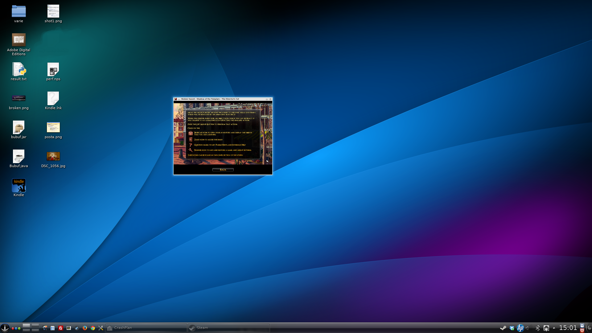
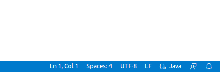

+++

title = "Laboratorio di Programmazione ad Oggetti"
description = "Laboratorio di Programmazione ad Oggetti, Ingegneria e Scienze Informatiche"
outputs = ["Reveal"]
aliases = ["/multiplatform/"]

+++

# Programmazione multipiattaforma

{}

---


## "Write once, run anywhere..."

Lo slogan, coniato originariamente da Sun Microsystems per illustrare i benefici del linguaggio Java, vale *a patto che*:

* **"write" sia fatta in modo corretto e robusto**;
    * ovvero, sia adottato un approccio di programmazione adeguato.
* **sia possibile distribuire ciascuna applicazione per qualunque piattaforma**.
    * ovvero, sia predisposto un packaging efficace.


---

## Accesso al file system

### Path e Separatori

Inserire dei *path assoluti* nel proprio sorgente è **sempre** fonte di problemi quando si scrive software multipiattaforma:

* `C:\Users\UserName\file` --- Non funzionerà su piattaforma *nix, e non funzionerà se l'utente Windows non è "UserName".
* `C:\MyProgram\file` --- Non funzionerà su piattaforma *nix, e non funzionerà se
l'installazione di Windows è sana e il software non è avviato con diritti di amministratore.
* `/home/username/file` --- Non funzionerà su piattaforma Windows, e non funzionerà se l'utente non è `username`.


#### Problemi


* I *separatori* per i path cambiano a seconda dell'OS
* La *struttura del file system* cambia con l'OS
* I *diritti* di lettura e scrittura cambiano con la configurazione

---

## Proprietà di sistema

Java fornisce nella classe `System` un metodo

```java
String getProperty(String p)
```

che consente di accedere a proprietà di sistema


### Proprietà relative al file system


* `file.separator` --- Restituisce `\` per Windows e `/` per Unix
* `java.home` --- La directory di installazione di Java
* `user.dir` --- La directory da cui il comando `java` è stato invocato
* `user.home` --- Restituisce la home directory dell'utente che ha lanciato `java`
* `user.name` --- Restituisce il nome utente

```java
public static final String PROP_FILE_SEPARATOR = "file.separator";

String separator = System.getProperty(PROP_FILE_SEPARATOR);
```


---

## Accesso ai dettagli del sistema

### Funzionalità OS-specifiche


* Talvolta è possibile che in una applicazione si debbano utilizzare librerie non disponibili o non licenziate per alcune piattaforme.
* A supporto di ciò, Java fornisce delle proprietà che consentono di *identificare OS, versione, e JVM corrente*.


#### Proprietà relative al sistema


* `java.version` --- La versione di `java` in uso. Si potrebbe decidere di non usare una funzionalità che si sa non esistere o essere buggata.
* `os.arch` --- L'architettura della CPU come rilevata dall'OS (x86, i386, amd64, x86\_64, IA64N, ARM, ...)
* `os.name` --- Il nome del sistema operativo (Linux, MacOS X, MacOS, Windows 10, Solaris, FreeBSD,  ...)
* `os.version` --- Restituisce per Windows il numero di versione effettivo (per esempio, Windows 10 restituisce 10.0), per MacOS il numero di versione (per esempio, 10.3.4), per Linux la versione
del kernel (es. 6.1)


---

## GUI scalabili e internazionalizzazione

### GUI scalabili -- Motivazioni


#### Flessibilità

Diversamente dagli anni 90, i dispositivi oggi hanno una *densità di pixel per area* **estremamente** variabile. Si va da 120 *PPI (Pixel Per Inch)* a 640 PPI, su schermi di dimensione estremamente variabile (da 3 a 200 pollici).


#### Multipiattaforma

Piattaforme diverse, anche a parità di schermo, possono adottare diverse convenzioni:

* Diversa grandezza di bordi
* Diversa spaziatura, dimensione e tipo di font
* Diverso sistema di decorazioni


Questi elementi sono stabiliti dal *window manager* (del *windowing system* del sistema utilizzato) e non dallo sviluppatore dell'applicazione. Come indicazione generale vale che **un'applicazione ben sviluppata eredita il "look and feel" dal sistema su cui sta girando**.


---

### Esempio: Finestra non ridimensionabile e bassa risoluzione


---

### Esempio: Finestra non ridimensionabile e alta risoluzione




---

## Best-practices per la costruzione di GUI

* A proposito della specifica delle dimensioni
    * La *dimensione di default* della finestra va calcolata *in base alla dimensione dello schermo*.
    * E' opportuno **non** *specificare dimensioni assolute in pixel* per i componenti della GUI, ma dimensionarli **in termini relativi** *rispetto al container*.
        * Anche per i layout è opportuno non utilizzare dimensioni fisse in pixel.
* A proposito dei font
    * I *font* possono essere allegati all'applicazione
    * La *dimensione dei font* può essere resa *relativa* alla dimensione corrente della view.
* *L'utente deve essere libero di ridimensionare l'interfaccia a piacimento per adattarla alla
propria configurazione di schermi*


---

## Supporto multilingua per le UI


* Sarebbe opportuno definire la UI una sola volta e cambiare dinamicamente le parti scritte (il testo) a seconda dell'impostazione della lingua di sistema (o della nostra applicazione).

* In realtà anche per il formato dei numeri, la valuta, le convenzioni sulla data, ...
    * un **locale** è un insieme di parametri che definiscono la lingua dell'utente, la sua regione, e le sue preferenze di visualizzazione delle GUI
    * un esempio di locale è `en_US_UNIX` (lingua inglese, Stati Uniti, piattaforma UNIX)


#### Java Resource Bundles

Java fornisce una architettura per l'internazionalizzazione (**i18n = internationalization**), che fa uso di `ResourceBundle` e di una serie di file di supporto (*properties files*).

- per localizzazione (**l10n = localization**) si intende invece il processo di adattare un prodotto internazionalizzato a un particolare locale

Per approfondimenti (per implementare il supporto multilingua):

* [https://docs.oracle.com/javase/tutorial/i18n/resbundle/index.html](https://docs.oracle.com/javase/tutorial/i18n/resbundle/index.html)
* [http://tutorials.jenkov.com/java-internationalization/resourcebundle.html](http://tutorials.jenkov.com/java-internationalization/resourcebundle.html)


---

# Corretta configurazione di un progetto Gradle

---

## Risorse nei progetti Gradle

```text
├── src
│   ├── main
│   │   ├── java
│   │   └── resources
│   └── test
│       ├── java
│       └── resources
├── build.gradle.kts
└── settings.gradle.kts
```


* Le cartelle `src/[main|test]/resources` contengono le risorse del progetto opportunamente organizzate
    * Per risorse si intendono icone, file di testo, video, immagini, modelli 3D e qualunque cosa sia necessaria al corretto funzionamento del programma ma non sia una libreria o un file sorgente.

---

## File ancillari per il progetto di OOP

Per OOP, alla struttura del progetto Gradle andranno aggiunti almeno altri due file

```text
├── src
│   ├── main
│   │   ├── java
│   │   └── resources
│   └── test
│       ├── java
│       └── resources
├── build.gradle.kts
├── LICENSE
├── README.md
└── settings.gradle.kts
```

#### `README.md`

* File con la descrizione del progetto: autori, breve guida d'uso, link a risorse.
    * GitHub è in grado di fare il parse del file e di integrarlo nella pagina del progetto, in modo da dargli una descrizione.

#### `LICENSE`

* File con informazioni circa la licenza, necessario affinché il progetto sia open source.
* Per software open source, si raccomanda l'uso di MIT license.
* Qualunque licenza GPL-compatibile è ritenuta idonea per il progetto del corso.

---

## Font ed encoding

### Font ed encoding

Le più note piattaforme utilizzano di default encoding diversi:

* **UTF-8** --- default su Linux, può essere considerato lo standard de-facto.
* **MacRoman** --- default su MacOS, raramente causa artefatti se riconvertito ad altri formati.
* **ISO-8859-1** --- default su Windows, può causare artefatti su quasi tutti i caratteri non ASCII se convertito a UTF-8.


#### Encoding per il codice sorgente

Solitamente, il codice sorgente si sviluppa utilizzando la codifica UTF-8
* Essenziale se si utilizzano caratteri non inclusi nella tabella ASCII (caratteri accentati, ad esempio).

---

### Configurazione di encoding e newline in VS Code

* `File -> Preferences -> Settings`
* Per l'opzione `Text Editor -> Files -> Encoding` selezionare `UTF-8`
* Per l'opzione `Test Editor -> Files -> Eol` selezionare `LF`

* In basso a destra nella finestra di VS Code c'è l'indicazione della codifica e di EOL per il file selezionato



---

# Caricamento di risorse dal classpath

---

<!-- write-here "shared-slides/java/it-classpath-resources.md" -->

<!-- end-write -->

---

<!-- write-here "shared-slides/build-systems/it-gradle-dependencies.md" -->

<!-- end-write -->

---

### Librerie particolarmente utili

* **Google Guava** ([https://github.com/google/guava](https://github.com/google/guava))

    * Il progetto Guava di Google raccoglie diverse librerie core sviluppate da Google che possono essere utilizzate per lo sviluppo di applicazioni.
    * Ad esempio, sono disponibili librerie per Collections Management, Concurrency, I/O, String Processing, ...

* **Apache Commons** ([https://commons.apache.org](https://commons.apache.org))

    * Estensioni al linguaggio (Commons Lang3)
    * Libreria matematica estesa (Commons Math3)
    * Accesso semplificato all'I/O (Commons IO)
    * Costruzione semi automatica di una command line (Commons CLI)
    * Encoding e crittazione (Commons Codec), compressione (Commons Compress)

* **Static Logger Facade for Java (SLF4J)** ([http://www.slf4j.org](http://www.slf4j.org))

    * Backend-independent logging (addio `println`)


---

### Top 20 Java Library

[

](http://blog.takipi.com/we-analyzed-60678-libraries-on-github-here-are-the-top-100)

---

### Awesome Java

Esiste una lista, costantemente manutenuta, che elenca le più comuni, diffuse e stabili librerie per una pletora di usi: [https://bit.ly/awesome-java](https://bit.ly/awesome-java)

#### USATELE!

* **Usare librerie e non reinventare la ruota è IMPORTANTE** e valutato
positivamente.
*  Attenzione però a scegliere le librerie dopo aver fatto il **modello del dominio**
dell'applicazione: **PRIMA** si studia il problema, **DOPO** si implementa una soluzione:
siete aspiranti ingegneri, cercate di lavorare sempre top-down quando possibile, non partite dalla libreria per costruirci sopra un software, ma partite dai requisiti e - se utile - sfruttate le librerie per soddisfarli.

#### Attenzione ai framework!

Alcune librerie sono costruite come *Framework*,
ossia come ossature di applicazioni,
pensate per velocizzare la costruzione di un certo tipo di software
* Esempio tipico: l'engine per videogames [libGDX](`https://libgdx.com/`)

Uno degli scopi del progetto di OOP è quello di misurare se siate bravi designer,
ma per farlo è necessario che il design della vostra applicazione l'abbiate fatto voi e non chi ha costruito il framework.

Vi raccomandiamo quindi di **evitare i framework**!
O, al più, usarli solo *dopo che il progetto è avviato* come semplice libreria
(non semplice e non sempre possibile)
