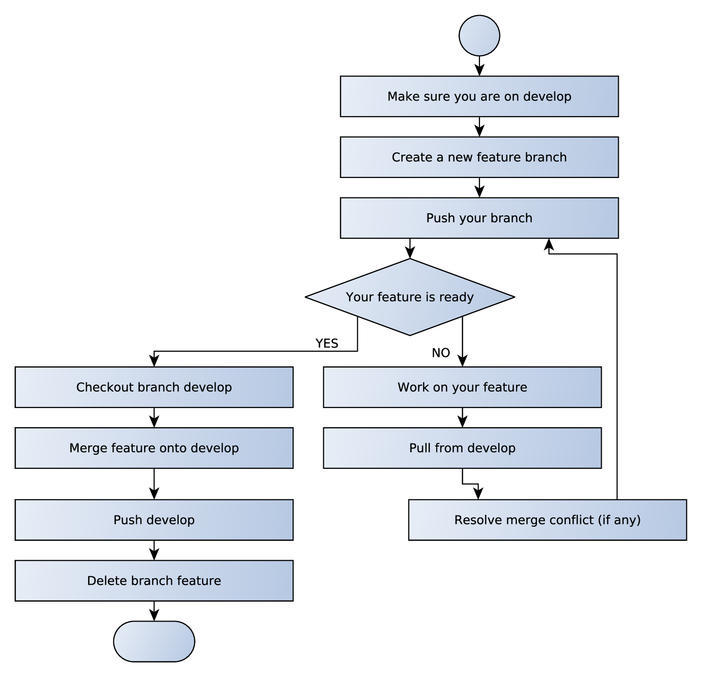

 
+++

title = "Laboratorio di Programmazione ad Oggetti"
description = "Laboratorio di Programmazione ad Oggetti, Ingegneria e Scienze Informatiche"
outputs = ["Reveal"]
aliases = ["/dvcs-workflow/"]

+++

# DVCS Workflow

<!-- write-here "cover.md" -->

<!-- end-write -->

---

## Dalle puntate precedenti

### DVCS

* DVCS sono strumenti **molto potenti** per tenere traccia in maniera efficiente della storia di un progetto
* Nascono in particolare come evoluzione dei tradizionali VCS (SVN, CVS, ...)
* Enfasi su una **miglior gestione del lavoro di team**
    * *Ma come organizzare un buon lavoro di squadra?*

### DVCS e teamwork
		
> La potenza è nulla senza controllo 

* La mancanza di un metodo chiaro e condiviso per utilizzarli può portare a risultati **DEVASTANTI**
    * L'impegno necessario per la parte di gestione diventa presto preponderante e insostenibile
* Ecco perché è bene adottare un **workflow collaborativo**
    * miglior qualità nei progetti
    * i vostri partner di progetto vi ringrazieranno!

### Quale workflow

* Come si sceglie un workflow?
* Bisogna trovare un giusto **trade-off** tra semplicità ed esigenze

---

## Tabella riassuntiva

|     | *Team sparso, scarsa fiducia* | *Team coeso, elevata fiducia* |
| --- | --- | --- |
| **_Progetti piccoli_** | Singolo branch, multiple fork e pull request.<br>**Tipico di piccoli progetti FOSS**<br>Il focus è quello di consentire a chiunque di collaborare senza che nessuno possa causare danni | Singolo Branch, singolo repository dove tutti hanno diritto di push.<br>**Tipico di piccoli progetti aziendali** *(ma anche dei progetti di OOP)*<br> Il focus è sulla semplicità del processo, si assume che chi è parte del team non faccia danni e possa quindi scrivere |
| **_Progetti grandi_** | Multipli branch, multiple fork e pull request<br>**Tipico di grandi progetti FOSS**<br>Stesso focus dei progetti open source piccoli, ma in questo caso il progetto, data la complessità, ha multipli branch attivi | Multipli branch, singolo repository dove tutti hanno diritto di push<br>**Tipico di grandi progetti aziendali**<br>Nonostante ci sia fiducia che i membri del team collaborino positivamente (e quindi tutti possono scrivere) il progetto è troppo complesso perché tutti insistano sullo stesso branch |

---

## Lavorare con fork e pull request

Ottimo per progetti open source dove si vogliano contributi di terzi,
e/o per team molto eterogenei,
dove qualcuno deve assicurarsi della qualità del codice prodotto da altri.

* Il maintainer crea il repository, ed è l'unico col diritto di scrittura
* Gli altri membri del team hanno una **fork** a testa
    * in caso di progetto FOSS, chiunque voglia collaborare
* Ciascuno lavora sulla propria fork, facendo pull dal repository "centrale" e push sulla propria fork
* Quando una feature è completa, o si arriva ad un buon grado di sviluppo, si apre una **pull request**
* Il maintainer revisiona il codice, assegna eventuali modifiche, e quando è soddisfatto accetta la pull request facendo il merge del codice nel repository principale

#### *Questo workflow è un overkill per il progetto di OOP*

* Rischia di essere troppo "burocratico" per il nostro progetto
* Raramente il team è così sbilanciato che uno degli studenti possa fare revisione del codice degli altri

#### *Tuttavia è giusto conoscerlo!*
* È il modo in cui potreste contribuire a progetti open source
* Se farete tesi o tirocini con il nostro gruppo di ricerca, lavorando su software che mateniamo noi, lavorerete così!

---

## Lavorare con multipli branch: **git-flow** 

Definito da *Vincent Driessen* e spiegato in ["A successful git branching model"](http://nvie.com/posts/a-successful-git-branching-model/)


---

### Alcune considerazioni

* Non lo useremo
    * troppo complicato per i nostri scopi
* Comunque molto interessante perché racchiude molti aspetti di un workflow collaborativo supportato da DVCS

### I branch in git-flow

* Sono il supporto fondamentale alle fasi del ciclo di vita del software
* Ogni fase/attività ha il proprio branch!
* Branching e merging all'ordine del giorno!

### Nomenclatura dei branch

- Tipici nomi sono, ad esempio `feature/<feature-name>` o `fix/<bug-name>`
    - È comune usare `/` come separatore: `feature/<feature-name>`, `bug/<bug-name>`
    - Si usa infatti categorizzare i branch in *gruppi*: `fix`, `feat`, `perf`...
- Varie convenzioni possono essere adottate (l'importante è essere consistenti)
    - Aggiunta di "componenti" al nome del branch, relativi ad es. 
        - all'autore/responsabile
        - a una *issue* (cf. Issue su GitHub) o *ticket*, o l'ID di un task o user story
- Nota: questi aspetti di nomenclatura e formattazione sono importanti anche a livello di commit (cf. [conventional commit](https://www.conventionalcommits.org/en/v1.0.0/))

---

### Un modello più semplice

* Un *branch principale*
    * Andrebbe tenuto sempre compilabile e "funzionante"
* *Feature branch* diversi e indipendenti, per sviluppi di nuove funzionalità
    * da sincronizzare riconciliandoli col branch principale (*frequentemente* per ridurre possibilità di conflitti complessi)


---

### Feature branch: processo

- nel modello semplificato (assumendo il branch principale si chiami `develop`) o in git flow



---

```bash
# Assuming there exists a remote repository called origin
# Create a new feature branch from develop and share it
git checkout develop
git checkout -b feature-mynewfeaturename
git push -u origin feature-mynewfeaturename

# WHILE your_feature_is_unfinished
# work on your feature:
git add mynewfiles
git add mymodifiedfiles
git add mydeletedfiles
git commit -m "my commit message"
# Merge develop in to prevent big merge conflicts!
git pull origin/develop
# You may need to solve a merge conflict here!
# Share and save your work
git push
# END-WHILE

# Merge feature onto develop
git checkout develop
git merge feature-mynewfeaturename

# Push develop
git push

# Delete the feature branch
git branch -d feature-mynewfeaturename
```

---

## Il repo ufficiale del vostro progetto
	
* Qualcuno di voi agirà come *repo maintainer*
    * *Creerà quindi il repository* in local con `git init`,
    * *Creerà un repository su GitHub* e *darà diritto di scrittura* anche agli altri membri del team
    * Lo registrerà come remote usando `git remote`
    * Farà il primo commit con il template di progetto fornito da noi
        * Progetti normali: https://github.com/unibo-oop/sample-gradle-project
        * Progetti con JavaFX: https://github.com/unibo-oop/sample-javafx-project
    * Farà il primo push
* Gli altri membri del team faranno il `clone`
* Ciascuno lavorerà parallelamente sul proprio repository locale (working copy), condividendo tramite `push` e `pull` il proprio lavoro con gli altri
* Chi stesse sviluppando delle feature, potrà creare un branch apposito per ciascuna di esse

---

# DVCS Workflow

<!-- write-here "cover.md" -->

<!-- end-write -->
